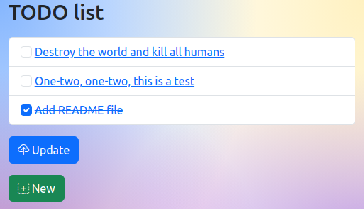

todo-django
===========



Environment
-----------

- Linux Mint 21.1
- Python 3.10.6
- pipenv, version 2022.11.11

Setup
-----

1. Create Python virtual environment and install dependencies:
    ```
    $ pipenv install
    ```
2. Activate virtual environment:
    ```
    $ pipenv shell
    ```
3. Go to application directory:
    ```
    $ cd todo_website
    ```
3. Copy default settings:
    ```
    $ cp todo_website/settings.dist.py todo_website/settings.py
    ```
4. Generate `SECRET_KEY`:
    ```
    $ python -c 'from django.core.management.utils import get_random_secret_key; print(get_random_secret_key())'
    ```
5. Replace `SECRET_KEY`:
    ```
    $ vim todo_website/settings.py
    ```
6. Create database:
    ```
    $ python manage.py migrate
    ```
7. Load demo data:
    ```
    $ python manage.py loaddata demo
    ```

Usage
-----

1. Run application:
    ```
    $ python manage.py runserver
    ```
2. Open http://localhost:8000/ with a web browser.

Test
----

1. Run tests:
    ```
    $ python manage.py test
    ```

Cleanup
-------

1. Exit virtual environment:
    ```
    $ exit
    ```
2. Destroy virtual environment:
    ```
    $ pipenv --rm
    ```

TODO
----

- ~~Icons~~
- Static files